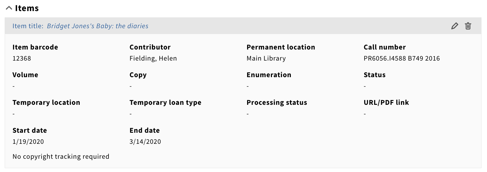

# Sequence of WSAPI operations when adding items

<!-- md2toc -l 2 operations-to-add-item.md -->
* [Background](#background)
* [Adding item 12368 to Calculus 201](#adding-item-12368-to-calculus-201)
    * [1. Post the barcode of the item to reserve](#1-post-the-barcode-of-the-item-to-reserve)
        * [Request](#request)
        * [Response](#response)
    * [2. Re-fetch the course](#2-re-fetch-the-course)
    * [3. Re-fetch the other courses in the same course-listing](#3-re-fetch-the-other-courses-in-the-same-course-listing)
    * [4. Fetch the reserves associated with the course-listing](#4-fetch-the-reserves-associated-with-the-course-listing)
        * [Request](#request)
        * [Response](#response)
    * [5. Fetch notes associated with the course](#5-fetch-notes-associated-with-the-course)
    * [6. Fetch note-types for some reason](#6-fetch-note-types-for-some-reason)
    * [Summary](#summary)
    * [UI state](#ui-state)
* [Returning to Calculus 201](#returning-to-calculus-201)
    * [1-4, 6-7, 9-10. Irrelevant requests](#1-4-6-7-9-10-irrelevant-requests)
    * [5. Re-fetching reserves](#5-re-fetching-reserves)
        * [Request](#request)
        * [Response](#response)
    * [8. Fetching items](#8-fetching-items)
        * [Request](#request)
        * [Response](#response)
* [Conclusion](#conclusion)


## Background

I have created a new item with barcode 12368. It is an item of _Bridget Jones's Baby: the diaries_ belonging to the Annex holding, with its own permanent location "Main Library" and its temporary location "ORWIG ETHNO CD". I am adding it to the course "Calculus 201", which at the beginning of this process has no reserves, to investigate the long-running issue
[MODCR-102](https://issues.folio.org/browse/MODCR-102).


## Adding item 12368 to Calculus 201

These operations occur after typing "12368" into the "Enter or scan barcode" area and clicking **Add item**.


### 1. Post the barcode of the item to reserve

#### Request

```
POST /coursereserves/courselistings/cef52efb-b3fd-4450-9960-1745026a99d1/reserves
{
  "courseListingId": "cef52efb-b3fd-4450-9960-1745026a99d1",
  "copiedItem": {
    "barcode": "12368"
  },
  "id": "dd85b89c-59a2-43ab-b972-4f5a7d63d86b"
}
```

#### Response
```
{
  "id": "dd85b89c-59a2-43ab-b972-4f5a7d63d86b",
  "courseListingId": "cef52efb-b3fd-4450-9960-1745026a99d1",
  "itemId": "dbc296f9-3a2c-4658-948c-324d069d5621",
  "copiedItem": {
    "barcode": "12368",
    "temporaryLocationId": "758258bc-ecc1-41b8-abca-f7b610822ffd",
    "permanentLocationId": "fcd64ce1-6995-48f0-840e-89ffa2288371",
    "title": "Bridget Jones's Baby: the diaries",
    "contributors": [
      {
        "name": "Fielding, Helen",
        "contributorNameTypeId": "2b94c631-fca9-4892-a730-03ee529ffe2a"
      }
    ],
    "publication": [
      {
        "publisher": "Alfred A. Knopf",
        "place": "New York",
        "dateOfPublication": "2016"
      }
    ],
    "callNumber": "PR6056.I4588 B749 2016",
    "instanceId": "7fbd5d84-62d1-44c6-9c45-6cb173998bbd",
    "instanceHrid": "inst000000000006",
    "instanceDiscoverySuppress": false,
    "holdingsId": "fb7b70f1-b898-4924-a991-0e4b6312bb5f"
  },
  "metadata": {
    "createdDate": "2023-02-28T16:35:37.539+00:00",
    "createdByUserId": "11469f02-5e55-5779-a16f-634209585c2b",
    "updatedDate": "2023-02-28T16:35:37.539+00:00",
    "updatedByUserId": "11469f02-5e55-5779-a16f-634209585c2b"
  }
}
```


### 2. Re-fetch the course

```
GET /coursereserves/courses/04ea3db8-e42a-4e18-b98d-cc447e3f9a57?unused=0
```
200 OK

The response does not include any mention of the newly-reserved item.


### 3. Re-fetch the other courses in the same course-listing

```
GET /coursereserves/courses?query=courseListingId%3D%3D%22cef52efb-b3fd-4450-9960-1745026a99d1%22%20not%20%28id%3D%3D%2204ea3db8-e42a-4e18-b98d-cc447e3f9a57%22%29
```
200 OK


### 4. Fetch the reserves associated with the course-listing

#### Request

```
GET /coursereserves/courselistings/cef52efb-b3fd-4450-9960-1745026a99d1/reserves?unused=0&expand=*&limit=500&query=cql.allRecords=1%20sortby%20copiedItem.title
```

#### Response

```
{
  "reserves": [
    {
      "id": "dd85b89c-59a2-43ab-b972-4f5a7d63d86b",
      "courseListingId": "cef52efb-b3fd-4450-9960-1745026a99d1",
      "itemId": "dbc296f9-3a2c-4658-948c-324d069d5621",
      "copiedItem": {
        "barcode": "12368",
        "temporaryLocationId": "758258bc-ecc1-41b8-abca-f7b610822ffd",
        "temporaryLocationObject": {
          "id": "758258bc-ecc1-41b8-abca-f7b610822ffd",
          "name": "ORWIG ETHNO CD",
          "code": "KU/CC/DI/O",
          "isActive": true,
          "institutionId": "40ee00ca-a518-4b49-be01-0638d0a4ac57",
          "campusId": "62cf76b7-cca5-4d33-9217-edf42ce1a848",
          "libraryId": "5d78803e-ca04-4b4a-aeae-2c63b924518b",
          "primaryServicePoint": "3a40852d-49fd-4df2-a1f9-6e2641a6e91f",
          "servicePointIds": [
            "3a40852d-49fd-4df2-a1f9-6e2641a6e91f"
          ]
        },
        "permanentLocationId": "fcd64ce1-6995-48f0-840e-89ffa2288371",
        "permanentLocationObject": {
          "id": "fcd64ce1-6995-48f0-840e-89ffa2288371",
          "name": "Main Library",
          "code": "KU/CC/DI/M",
          "isActive": true,
          "institutionId": "40ee00ca-a518-4b49-be01-0638d0a4ac57",
          "campusId": "62cf76b7-cca5-4d33-9217-edf42ce1a848",
          "libraryId": "5d78803e-ca04-4b4a-aeae-2c63b924518b",
          "primaryServicePoint": "3a40852d-49fd-4df2-a1f9-6e2641a6e91f",
          "servicePointIds": [
            "3a40852d-49fd-4df2-a1f9-6e2641a6e91f"
          ]
        },
        "title": "Bridget Jones's Baby: the diaries",
        "contributors": [
          {
            "name": "Fielding, Helen",
            "contributorNameTypeId": "2b94c631-fca9-4892-a730-03ee529ffe2a"
          }
        ],
        "publication": [
          {
            "publisher": "Alfred A. Knopf",
            "place": "New York",
            "dateOfPublication": "2016"
          }
        ],
        "callNumber": "PR6056.I4588 B749 2016",
        "instanceId": "7fbd5d84-62d1-44c6-9c45-6cb173998bbd",
        "instanceHrid": "inst000000000006",
        "instanceDiscoverySuppress": false,
        "holdingsId": "fb7b70f1-b898-4924-a991-0e4b6312bb5f"
      },
      "metadata": {
        "createdDate": "2023-02-28T16:35:37.539+00:00",
        "createdByUserId": "11469f02-5e55-5779-a16f-634209585c2b",
        "updatedDate": "2023-02-28T16:35:37.539+00:00",
        "updatedByUserId": "11469f02-5e55-5779-a16f-634209585c2b"
      }
    }
  ],
  "totalRecords": 1
}
```

Note that this includes both the permament and temporary locations of the reserved item ("Main Library" and "ORWIG ETHNO CD").


### 5. Fetch notes associated with the course

```
GET /note-links/domain/courses/type/course/id/04ea3db8-e42a-4e18-b98d-cc447e3f9a57?limit=100000&order=desc&orderBy=updatedDate&status=assigned
```
200 OK


### 6. Fetch note-types for some reason

```
GET /note-types?limit=500&query=cql.allRecords%3D1%20sortby%20name
```
200 OK


### Summary

The only operation in this sequence that is not read-only is #1, the initial POST to the course-listing's reserves. The only relevant request subsequent to this is #4, fetching the updated list of reserves. Requests #2 and #3 are unnecessary re-fetches of the course and its cross-listed courses (of which there are none); Requests #5 and #6 pertain to the notes facility, which nothing to do with course reserves _per se_.


### UI state

At this stage in the process, the newly-added reserve is shown with the correct Item barcode, Contributor, Permanent location, call number, etc., but with the Temporary location shown as empty.




## Returning to Calculus 201

On closing the course Calculus 201, more requests are issued as the list of courses is re-listed. These are of no interest to us. When then clicking again on Calculus 201 to view its details, the following operations occur:


### 1-4, 6-7, 9-10. Irrelevant requests

Operations #1 and #9 are for notes; #2 and #10 are for note-types, which are of no interest. I have no idea why the repeats.

Operation #3 fetches the course, which does not directly include information about the reserves; operation #4 fetches the cross-listed courses (of which there are still none). These run as before and are not of interest here.

Operation #6 fetches the authority list of terms.

Operation #7 fetches mod-configuration entries. (There are none; one can be added to specify that duplicating a course, cross-listed courses should also be duplicated by default.)


### 5. Re-fetching reserves

#### Request

```
GET /coursereserves/courselistings/cef52efb-b3fd-4450-9960-1745026a99d1/reserves?unused=0&expand=*&limit=500&query=cql.allRecords=1%20sortby%20copiedItem.title
```

#### Response

```
{
  "reserves": [
    {
      "id": "dd85b89c-59a2-43ab-b972-4f5a7d63d86b",
      "courseListingId": "cef52efb-b3fd-4450-9960-1745026a99d1",
      "itemId": "dbc296f9-3a2c-4658-948c-324d069d5621",
      "copiedItem": {
        "barcode": "12368",
        "temporaryLocationId": "758258bc-ecc1-41b8-abca-f7b610822ffd",
        "temporaryLocationObject": {
          "id": "758258bc-ecc1-41b8-abca-f7b610822ffd",
          "name": "ORWIG ETHNO CD",
          "code": "KU/CC/DI/O",
          "isActive": true,
          "institutionId": "40ee00ca-a518-4b49-be01-0638d0a4ac57",
          "campusId": "62cf76b7-cca5-4d33-9217-edf42ce1a848",
          "libraryId": "5d78803e-ca04-4b4a-aeae-2c63b924518b",
          "primaryServicePoint": "3a40852d-49fd-4df2-a1f9-6e2641a6e91f",
          "servicePointIds": [
            "3a40852d-49fd-4df2-a1f9-6e2641a6e91f"
          ]
        },
        "permanentLocationId": "fcd64ce1-6995-48f0-840e-89ffa2288371",
        "permanentLocationObject": {
          "id": "fcd64ce1-6995-48f0-840e-89ffa2288371",
          "name": "Main Library",
          "code": "KU/CC/DI/M",
          "isActive": true,
          "institutionId": "40ee00ca-a518-4b49-be01-0638d0a4ac57",
          "campusId": "62cf76b7-cca5-4d33-9217-edf42ce1a848",
          "libraryId": "5d78803e-ca04-4b4a-aeae-2c63b924518b",
          "primaryServicePoint": "3a40852d-49fd-4df2-a1f9-6e2641a6e91f",
          "servicePointIds": [
            "3a40852d-49fd-4df2-a1f9-6e2641a6e91f"
          ]
        },
        "title": "Bridget Jones's Baby: the diaries",
        "contributors": [
          {
            "name": "Fielding, Helen",
            "contributorNameTypeId": "2b94c631-fca9-4892-a730-03ee529ffe2a"
          }
        ],
        "publication": [
          {
            "publisher": "Alfred A. Knopf",
            "place": "New York",
            "dateOfPublication": "2016"
          }
        ],
        "callNumber": "PR6056.I4588 B749 2016",
        "instanceId": "7fbd5d84-62d1-44c6-9c45-6cb173998bbd",
        "instanceHrid": "inst000000000006",
        "instanceDiscoverySuppress": false,
        "holdingsId": "fb7b70f1-b898-4924-a991-0e4b6312bb5f"
      },
      "metadata": {
        "createdDate": "2023-02-28T16:35:37.539+00:00",
        "createdByUserId": "11469f02-5e55-5779-a16f-634209585c2b",
        "updatedDate": "2023-02-28T16:35:37.539+00:00",
        "updatedByUserId": "11469f02-5e55-5779-a16f-634209585c2b"
      }
    }
  ],
  "totalRecords": 1
}
```
Both the request and its response are identical to #4 in the first phase above.


### 8. Fetching items

When there are reserves, the underlying items are also fetched -- primarily to get availability information, but the uses of the variable `item` in [`<ViewCourseReserves>`](../src/components/ViewCourse/sections/ViewCourseReserves.js) suggest that something more is going on, the details of which I no longer recall.

#### Request

```
GET /inventory/items?limit=20&query=id%3D%28%22dbc296f9-3a2c-4658-948c-324d069d5621%22%29
```

#### Response

```
{
  "items": [
    {
      "id": "dbc296f9-3a2c-4658-948c-324d069d5621",
      "_version": "3",
      "status": {
        "name": "Available",
        "date": "2023-02-28T16:34:02.272+00:00"
      },
      "administrativeNotes": [],
      "title": "Bridget Jones's Baby: the diaries",
      "callNumber": "PR6056.I4588 B749 2016",
      "hrid": "it00000000014",
      "contributorNames": [
        {
          "name": "Fielding, Helen"
        }
      ],
      "formerIds": [],
      "discoverySuppress": null,
      "holdingsRecordId": "fb7b70f1-b898-4924-a991-0e4b6312bb5f",
      "barcode": "12368",
      "notes": [],
      "circulationNotes": [],
      "tags": {
        "tagList": []
      },
      "yearCaption": [],
      "electronicAccess": [],
      "statisticalCodeIds": [],
      "purchaseOrderLineIdentifier": null,
      "materialType": {
        "id": "1a54b431-2e4f-452d-9cae-9cee66c9a892",
        "name": "book"
      },
      "permanentLoanType": {
        "id": "2b94c631-fca9-4892-a730-03ee529ffe27",
        "name": "Can circulate"
      },
      "permanentLocation": {
        "id": "fcd64ce1-6995-48f0-840e-89ffa2288371",
        "name": "Main Library"
      },
      "temporaryLocation": {
        "id": "758258bc-ecc1-41b8-abca-f7b610822ffd",
        "name": "ORWIG ETHNO CD"
      },
      "metadata": {
        "createdDate": "2023-02-28T16:34:02.271+00:00",
        "createdByUserId": "11469f02-5e55-5779-a16f-634209585c2b",
        "updatedDate": "2023-02-28T16:35:37.778+00:00",
        "updatedByUserId": "11469f02-5e55-5779-a16f-634209585c2b"
      },
      "effectiveCallNumberComponents": {
        "callNumber": "PR6056.I4588 B749 2016",
        "prefix": null,
        "suffix": null,
        "typeId": null
      },
      "effectiveShelvingOrder": "PR 46056 I4588 B749 42016",
      "isBoundWith": false,
      "effectiveLocation": {
        "id": "758258bc-ecc1-41b8-abca-f7b610822ffd",
        "name": "ORWIG ETHNO CD"
      }
    }
  ],
  "totalRecords": 1
}
```


## Conclusion

When an item is first reserved to a course, the resulting display is put together using the data about the reserves associated with the course-listing; but when returning to the course, the underlying items are also available, and are used in ways that are not yet clear to me. Since the response to fetching the reserves themselves is identical in both scenarios (phase 1 request 4, and phase 2 request 5), the presence of the data about the items is most likely what causes the difference in display.


