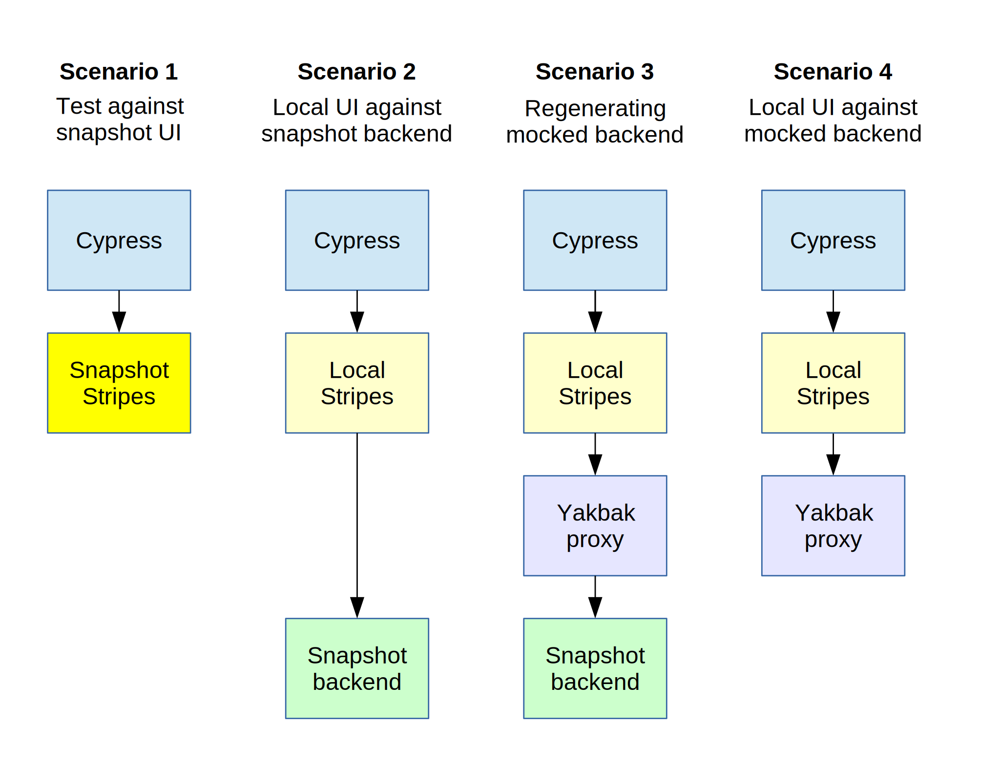
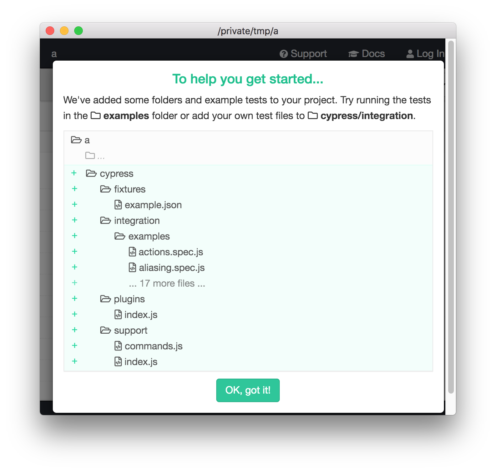

# Testing Stripes modules with Cypress and Yakbak

Mike Taylor, Index Data. &lt;mike@indexdata.com&gt;

6-7 July 2020.

<!-- md2toc -l 2 testing-with-cypress.md -->
* [Introduction](#introduction)
* [Components of a testing regimen](#components-of-a-testing-regimen)
    * [The components](#the-components)
        * [Cypress to run tests against the UI](#cypress-to-run-tests-against-the-ui)
        * [Stripes CLI to provide the UI](#stripes-cli-to-provide-the-ui)
        * [FOLIO backend](#folio-backend)
        * [Yakbak proxy](#yakbak-proxy)
    * [Scenarios](#scenarios)
        * [Overview](#overview)
        * [Scenario 1. Testing against the Snapshot UI](#scenario-1-testing-against-the-snapshot-ui)
        * [Scenario 2. Local UI against the Snapshot backend](#scenario-2-local-ui-against-the-snapshot-backend)
        * [Scenario 3. Regenerating the mocked backend](#scenario-3-regenerating-the-mocked-backend)
        * [Scenario 4. Local UI against the mocked backend](#scenario-4-local-ui-against-the-mocked-backend)
        * [Summary](#summary)
* [Setting up Cypress](#setting-up-cypress)
    * [Initialization and pruning](#initialization-and-pruning)
    * [Jenkins integration](#jenkins-integration)
    * [ESLint configuration](#eslint-configuration)
    * [Measuring code coverage](#measuring-code-coverage)
        * [Instrumenting the code](#instrumenting-the-code)
        * [Writing coverage data to files](#writing-coverage-data-to-files)
        * [Generating coverage reports](#generating-coverage-reports)
* [Now what?](#now-what)


## Introduction

In summer of 2020, as it became apparent that automated UI tests would be required for [FOLIO](https://www.folio.org/)'s [Course Reserves module `ui-courses`](https://github.com/folio-org/ui-courses), there was an opportunity to reassess how we go about testing in the world of Stripes (FOLIO's UI toolkit).

Previously, testing had taken two separate tracks: the use of [NightmareJS](http://www.nightmarejs.org/) to automate end-to-end testing for integration tests; and of [BigTest](https://bigtestjs.io/), including its mocking facilities, to create unit tests that do not require a FOLIO backend to be available. So UI modules have Nightmare-based integration tests, some have BigTest-based unit-tests and some have both. Both NightmareJS and BigTest are rather elderly, and not well supported. Almost all UI modules' tests are flaky, due largely to deficiencies in the Nightmare and BigTest libraries that they are based on. As a result, UI test maintenance is a major resource sink in the FOLIO project.

We investigated alternative approaches, documenting the issues and outcomes in [_Notes on automated UI tests_](testing-notes.md). The present document can be considered a sequel to that one, and lays out in more detail how we implement the chosen alternative approach.

The new approach used in testing Course Reserves is:
* [Cypress](https://www.cypress.io/) for browser automation to drive tests, including the [Mocha testing framework](https://mochajs.org/) and [Chai assertion library](https://www.chaijs.com/) that it provides.
* [Yakbak](https://github.com/flickr/yakbak) to record "tapes" of interactions with the backend and play them back.

Using YakBak in this way makes it possible write a single set of tests in Cypress. The tests can exercise the whole FOLIO stack in integration testing, writing Yakbak tapes as a side-effect; and they can exercise the frontend alone in unit testing, reading Yakbak tapes to mock the backend.

(There are other and lower levels of unit-testing that might also be desirable, such and verifying that individual React components render their data in the expected way. The present document does not address this level of testing.)


## Components of a testing regimen

First we will consider the four primary components of the testing system; then we will analyse the different ways of plugging them together.


### The components


#### Cypress to run tests against the UI

[Cypress](https://www.cypress.io/) is a much more modern and all-embracing browser automation framework than Nightmare. It comes with test-running (via Mocha) and assertion evaluation (via Chai) baked in. Crucially, it runs the JavaScript of the tests from _within_ the browser. This has several valuable consequences:
* The testing dashboard is shown in a sidebar on the browser.

* Tests can be paused while running and single-stepped.
* After they have run, you can "time travel" to see the browser's state at different points in the process by navigating through the list of tests in the sidebar.
* Tests have the option of usin state from within the browser: for example, logging out of FOLIO by directly invoking `localforage.removeItem('okapiSess')`.

Running Cypress tests also leaves behind useful artifacts: a video of the browser throughout the run, and screenshots of the various fail states.

Cypress has
[voluminous and helpful documentation](https://docs.cypress.io), including both
[tutorials](https://docs.cypress.io/guides/overview/why-cypress.html#In-a-nutshell)
and
[reference guides](https://docs.cypress.io/api/api/table-of-contents.html);
and
[a Gitter](https://gitter.im/cypress-io/cypress)
(Slack-like discussion app) where questions are usually answered helpfully and promptly.


#### Stripes CLI to provide the UI

Cypress can run directly against a hosted FOLIO UI such as [FOLIO Snapshot](https://folio-snapshot.aws.indexdata.com/) (see Scenario 1 below) but most of the time its value is in running against a local frontend built from the current source-code of the module being tested.

Stripes bundles are built by [the Stripes CLI](https://github.com/folio-org/stripes-cli/). It can build an app or set of apps into a bundle of static files to be served by any HTTP server, or it can build the bundle in memory and serve it itself. The latter mode is most useful in development as it can respond quickly to changes in the source code.

The Stripes CLI has built-in support for tests based on NightmareJS or BigTest, but not for other frameworks including Cypress. It turns out that this does not matter too much: it's possible simply to launch the CLI in build-and-serve mode, and run tests against it. The facilities that it provides to Nightmare tests -- access to a config structure and some helper functions -- would be nice to have in Cypress, but are not indispensible.


#### FOLIO backend

A FOLIO backend is a big, heavy unit, containing an [Okapi](https://github.com/folio-org/okapi) fronting a set of at least a dozen modules, often many more. Running a FOLIO backend is a laborious inconvenience for a frontend developer. This can be ameliorated by using a "FOLIO-in-a-box" virtual machine [provisioned by Vagrant](https://github.com/folio-org/folio-ansible), but the resulting VM is memory-hungry and best avoided where possible.

As a result, UI testing is often most conveniently performed against one of the public FOLIO nodes. There are
[several of these](https://dev.folio.org/guides/automation/)
including
[Fameflower-Dev](https://folio-fameflower.dev.folio.org/),
[Snapshot](https://folio-snapshot.aws.indexdata.com/)
and
[Snapshot-Stable](https://folio-snapshot-stable.aws.indexdata.com/). Since Snapshot is the most frequently updated of these (and therefore most likely to have fully up-to-date back-end modules), we will refer to it throughout this document, but any FOLIO backend can be used.


#### Yakbak proxy

While the Yakbak library provides all the facilities we need to record and play back tapes in place of a real FOLIO backend, it can be awkward to integrate. Typically, the tests themselves are wired to know about Yakbak, to start and configure a Yakbak server, and to direct their requests to it rather than to the real backend. This introduces additional complexity to the tests and spreads responsiblity in an error-prone way.

Instead, we created [`yakbak-proxy`](https://github.com/folio-org/yakbak-proxy), a simple standalone program that proxies HTTP requests to a nominated real server, while recording and/or playing back tapes. The [the usage documentation](for details), but most importantly the proxy may be run in `--norecord` mode, in which case it will _never_ call out to the real backend but only serve responses from tapes that it has previously made.

(The Yakbak proxy can of course be used with any server-client system to generate and replace tapes. In particular, it can be used to record the responses for the existing Nightmare-based tests of other Stripes apps.)


### Scenarios


#### Overview

The software components described above can be plugged together in various combinations to exercise different parts of the system in different ways.

We are now in a position to examine four testing scenarios. In the diagram below, blue boxes represent Cypress driving a Web browser; yellow boxes represent a Stripes UI (deep yellow for a remote hosted UI and pale yellow for a local UI in developement); purple boxes represent the Yakbak proxy; and green boxes represent FOLIO backends. As noted above, we describe this arrangement using FOLIO Snapshot as the backend, but any running backend can be used.



We can now examine each scenario is more detail.


#### Scenario 1. Testing against the Snapshot UI

In the simplest scenario, the Cypress tests run against a remote UI, such as that provided by FOLIO Snapshot. This is useful for two reasons: to get Cypress testing up and running with minimal scaffolding, and to verify that deployed versions of a FOLIO app pass the tests.

THe default UI tested by Cypress is specified by the `baseUrl` entry in the `cypress.json` configuration file. However, this can be overridden at run-time by the `-config` option of the Cypress CLI as follows:

	cypress run --config baseUrl=https://folio-snapshot.aws.indexdata.com


#### Scenario 2. Local UI against the Snapshot backend

In the second scenario shows above, Stripes is running locally as Cypress is connecting to it -- but the local UI is connecting directly to remote FOLIO backend such that that provided by the public FOLIO Snapshot server. This is useful as an end-to-end integration test.

The Cypress configuration in `ui-courses` establishes http://localhost:3001/ as the default UI to connect to, so this need not be overridden with `--config` when running in this way. The Stripes CLI will listen on port 3000, but this can be changed using the `--port` argument, so running the two services in different terminals:

	terminal1$ stripes serve --port 3001
	terminal2$ cypress run

(It is helpful to use a port other than the default 3000 to avoid the possibility of a clash with another Stripes server already running on port 3000.)

If running both parts of this together -- for example, in batch mode as part of a CI job -- it is necessary to run the Stripes server in the background and ensure that the Stripes server has begun listening before the Cypress tests commence. The simplest way to do this is with [the `wait-on` utility](https://github.com/jeffbski/wait-on), which simply waits until a given URL can be successfully requested before exiting. It is also polite to shut down the Stripes service after the tests have completed. So:

	stripes serve --port 3001 & wait-on http://localhost:3001 && cypress run && kill $!


#### Scenario 3. Regenerating the mocked backend

This scenario is the same as the second, except that all traffic between the Stripes UI and the FOLIO backend is proxied via the Yakbak proxy so that tapes can be made of the requests and their corresponding responses.

To do this, it necessary to include quite a bit of configuration:
* The Yakbak proxy must be configured to contact the real backend, which is done by specifying the backend service's URL on the command-line.
* The Yakbak must listen on a specified port: this can be done using the `-p` command-line options, but the defeault of 3002 is often appropriate.
* The Stripes UI must be configured to use the Yakbak proxy as its FOLIO service, which can be done using its `--okapi` command-line argument.

It is also helpful to remove any existing tapes to ensure that we have a complete new set.

	terminal1$ stripes serve --port 3001 --okapi http://localhost:3002
	terminal2$ rm -rf tapes && yakbak-proxy -i https://folio-snapshot-okapi.aws.indexdata.com
	terminal3$ cypress run

(The other option here given to `yakbak-proxy` is `-i`, which tells it to ignore headers when identifying requests, so that when the tapes are replayed a given request is recognised provided only that its protocol, method and URL are the same as before.)

Note that there is rather a lot of plumbing here: Cypress must contact the Stripes UI on the correct port, the Stripes UI must contact the Yakbak proxy on the correct port, and the Yakbak proxy must contant the FOLIO backend on the correct URL. Some of this is obscured in the commands above because the Cypress configuration sets its connection URL appropriately, and because the Yakbak proxy's default port of 3002 is suitable.

When running in CI, both the Stripes server and the Yakbak proxy must be run in the background, and as before Cypress must not be started until the Stripes server is listening for connections. Now that there are two background processes to be killed, we need to do a bit more work in order to capture both of the process-IDs to kill:

	stripes serve --port 3001 --okapi http://localhost:3002 & pid1=$! &&
	rm -rf tapes &&
	yakbak-proxy -v -i https://folio-snapshot-okapi.aws.indexdata.com & pid2=$! &&
	wait-on http://localhost:3001 &&
	cypress run &&
	kill $pid1 $pid2

This is a slightly fearsome command (and it is a single shell command, even though here it is shown broken over six lines for clarity).


#### Scenario 4. Local UI against the mocked backend

This is the unit-testing scenario, which can only be run after tapes have been generated by scenario 3. In this, the Yakbak proxy is invoked (using the `--norecord` or `-n` command-line option) not to contact any back-end at all, but only to supply responses to requests for which it has tapes (returning 404 for any requests whose responses have not already been recorded).

Invocation is very similar to that of scenario 3, except that the `tapes` directory is of course not removed, and the `-n` command-line option is given to `yakbak-proxy`. Hence:

	stripes serve --port 3001 --okapi http://localhost:3002 & pid1=$! &&
	rm -rf tapes &&
	yakbak-proxy -v -i https://folio-snapshot-okapi.aws.indexdata.com & pid2=$! &&
	wait-on http://localhost:3001 &&
	cypress run &&
	kill $pid1 $pid2


#### Summary

The same set of software components, then, can be be used to run in several different ways. In the `ui-courses` package file, `scripts` entries are provided for each of these scenarios:

1. `yarn test-folio-snapshot` -- local tests against a remote UI
2. `yarn test-running-service` -- against a local UI with a remote backend
3, `yarn regenerate` -- against local UI via a taping proxy to a remote backend
4. `yarn test` -- against a local UI with a mocked backend provided by tapes

The last of these is the command run by [Jenkins](https://www.jenkins.io/) in continuous integration -- see [below](#jenkins-integration) for details.

It _may_ be worth building a higher-level tool to invoke the various software components in the combinations required for these scenarios; but for now we go the more explicit route of invoking each component separately.


## Setting up Cypress


### Initialization and pruning

Cypress is easily added to a project's development dependencies using `yarn add --dev cypress`. It is run in interactive mode using `yarn cypress open` and in batch mode using `yarn cypress run`. The first time it is run in interactive mode, it sets up a directory structure:



This structure is described in detail in [the Cypress documentation](https://docs.cypress.io/guides/core-concepts/writing-and-organizing-tests.html#Folder-Structure) but in very brief summary:
* Everything is kept in the `cypress` director: we do not use a `test` directory.
* `fixtures` contains static data files used for explicitly programmed mocks. We do not use these.
* `integration` contains the actual tests.
* `plugins` and `support` provides ways to extend Cypress's core functionality.
* `videos` and `screenshots` are generated when tests are run.

The `integration` directory comes populated with many example tests, which we don't need in our repositories. These should all be deleted. The unused `fixtures` directory can also be deleted.

Annoyingly, `fixtures` has a habit of reappearing (along with a single tiny fixture file) after being deleted, so it's best to add a `cypress/.gitignore` file preventing this from being accidentally added to the project's git archive.


### Jenkins integration

FOLIO's Jenkins configuration [has been extended](https://issues.folio.org/browse/FOLIO-2674) to preserve the generated videos and screeshots when Cypress runs in CI. However, since either or both of those directories might be created, it would be awkward for the Jenkins configuration to try to preserve either or both. Instead, we tweak Cypress's default behaviour so that it placed both these directories into `cypress/artifacts`, and Jenkins preserves only that directory.

This change is made within the `cypress.json` configuration file at the top level of the project (i.e. alongside, not within, the `cypress` directory). Two two keys `videosFolder` and `screenshotsFolder` must be provided along with the default `baseUrl`, so the file reads:

	{
	  "baseUrl": "http://localhost:3001/",
	  "videosFolder": "cypress/artifacts/videos",
	  "screenshotsFolder": "cypress/artifacts/screenshots"
	}

The result of this can be seen in Jenkins
[project pages](https://jenkins-aws.indexdata.com/job/folio-org/job/ui-courses/job/master/)
and
[build pages](https://jenkins-aws.indexdata.com/job/folio-org/job/ui-courses/job/master/233/),
both of which include a "Built artifacts" link to `cypress.tar.gz`. For each build, this archive contains the videos and/or screenshots generated by the run.


### ESLint configuration

Style conventions for Cypress tests are rather different from those used for Stripes app code. As a result, we need to provide a different ESLint configuration, which is based on the `cypress` ESLint plugin, which knows about the global variables that Cypress injects in the test context, and which knows to expect no semi-colons at the ends of lines. So we need `cypress/.eslintrc` along these lines:

	{
	  "plugins": [
	    "cypress"
	  ],
	  "globals": {
	    "cy": "readonly",
	    "describe": "readonly",
	    "it": "readonly",
	    "expect": "readonly"
	  },
	  "rules": {
	    "semi": ["warn", "never"]
	  }
	}


### Measuring code coverage

To measure code coverage of Cypress-based tests is a three-stage process: it's necessary to instrument the code so that it generates coverage data, to get that data written to files, and to interpret the data in human-readable formats. Fortunately, all of these turn out to be fairly simple.

<!--
XXX delete this obsolete comment
I have not yet made a serious attempt to get Cypress to provide me with code coverage statistics, but I know it can be done. Some places to start include
* [_Code Coverage_ in the Cypress documentation](https://docs.cypress.io/guides/tooling/code-coverage.html)
* [Cypress code coverage for applications created using create-react-app v3
](https://www.cypress.io/blog/2019/09/05/cypress-code-coverage-for-create-react-app-v3/)
* [Generate a Code Coverage Report from Running End-to-End Test with Cypress.io
](https://levelup.gitconnected.com/generate-code-coverage-report-from-running-e2e-test-with-cypress-io-aaf6d47499e8)
* [`@cypress/code-coverage`](https://github.com/cypress-io/code-coverage)

**XXX The rest of this section is notes in progress**

It looks like the way to generate instrumentation is with Babel's Istanbul plugin [`babel-plugin-instabul`](https://github.com/istanbuljs/babel-plugin-istanbul)
and the way to generate reports about the data it gathers is with Cypress's misleadingly named Code Coverage plugin
[`@cypress/code-coverage`](https://github.com/cypress-io/code-coverage).
-->


#### Instrumenting the code

[The Istanbul library](https://istanbul.js.org/) knows how to modify JavaScript code by inserting statements that increment counters when different regions of the code are reached, and there is [a Babel plugin](https://github.com/istanbuljs/babel-plugin-istanbul) that uses it to have this happen for any code that is already being translated by Babel -- as Stripes modules are.

To use this for your app, `yarn add --dev babel-plugin-istanbul`, then create a `.babelrc` in the top level of the project:

	{
	  "env": {
	    "test": {
	      "plugins": [ "istanbul" ]
	    }
	  }
	}

XXX `NODE_ENV=test yarn start`


#### Writing coverage data to files

XXX

For reasons I do not understand, `@cypress/code-coverage` must be installed as a regular dependency, not a dev dependency: otherwise `yarn start` will fail, saying:

	Error: Cannot find module '@babel/plugin-proposal-decorators' from '/Users/mike/ui-courses'


#### Generating coverage reports

XXX

```
$ nyc report --reporter=text-summary

=============================== Coverage summary ===============================
Statements   : 36.54% ( 228/624 )
Branches     : 27.57% ( 75/272 )
Functions    : 23.48% ( 54/230 )
Lines        : 37.77% ( 224/593 )
================================================================================
Done in 0.57s.
```


## Now what?

Some thoughts on where we might go next ...

As noted [above](#stripes-cli-to-provide-the-ui), when the Stripes CLI is used to run Nightmare tests, it furnishes a set of helper functions to the tests, which can be used for common actions like logging in, switching to a specific app, and logging out. As we gain experience in using Cypress with Stripes, we may find it helpful to provide **a standard Cypress-for-Stripes library** of similar functions that all UI apps using Cypress testing can make use of. If we do this, we may find it simplest to provide these as simple importable function, as Cypress commands (in `cypress/support/commands.js`) or as Cypress plugins (in `cypress/plugins`). More experience is needed before a decision can be made.

Also as noted [above](#summary), it may prove worthwhile to simplify invocation of the various testing scenarios by providing a higher-level script that starts all the nececesary software components with appropriate plumbing to connect each to the others. Again, only experience will show whether this would be worth the work of building it -- or even whether the addition of another layer would make the underlying reality _more_ difficult to understand.

For further learning:
* [_Best Practices_ in the Cypress documentation](https://docs.cypress.io/guides/references/best-practices.html)
* [The Cypress documentation more generally](https://docs.cypress.io/)
* [The example tests generated for a new Cypress installation](https://github.com/cypress-io/birdboard/tree/master/cypress/integration/examples) will probably illustrate numerous helpful techniques.
* [Numerous tutorial videos]https://www.youtube.com/c/Cypressio/videos]

Finally: feedback on this document is welcome! Email &lt;mike@indexdata.com&gt;


